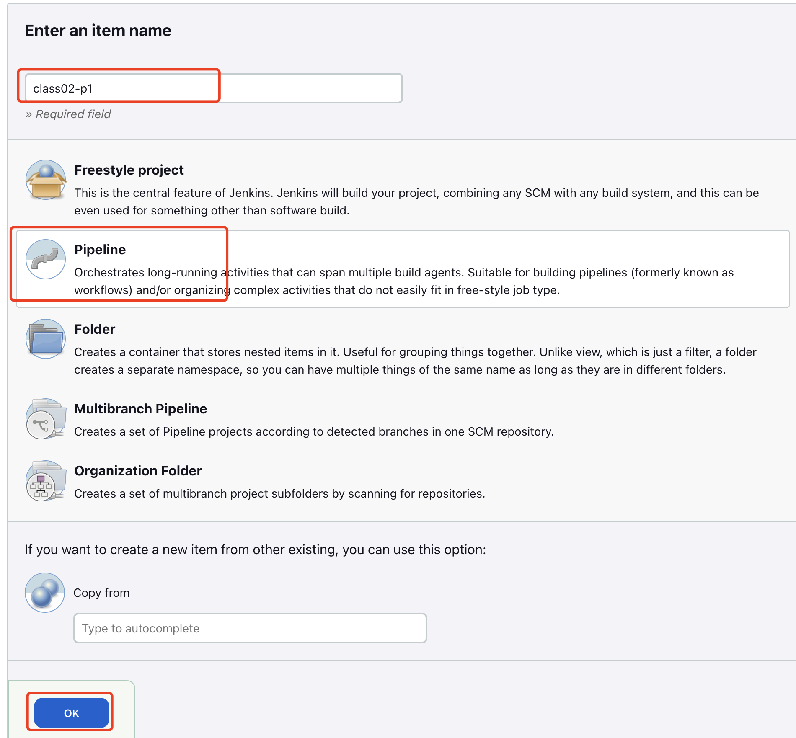

# jenkins-learn
Learn jenkins by jenkinsfile using pipeline

# Class 01: Install Jenkins Server and run samples

- Jenkins-learn code: https://github.com/AmyHoney/jenkins-learn
- SCM: source code management, 来源可以是git，或者none

## 1. Install and configure Jenkins using Docker

单机版

### 1.1 install Jenkins

```bash
# Need to have Docker and Java installed before install Jenkins 
vmware@sc1-10-168-189-240:~$ docker version
Client:
 Version:           19.03.8.   
 API version:       1.40
 Go version:        go1.13.8
 Git commit:        afacb8b7f0
 Built:             Fri Dec 18 12:15:19 2020
 OS/Arch:           linux/amd64
 Experimental:      false

Server:
 Engine:
  Version:          19.03.8
  API version:      1.40 (minimum version 1.12)
  Go version:       go1.13.8
  Git commit:       afacb8b7f0
  Built:            Fri Dec  4 23:02:49 2020
  OS/Arch:          linux/amd64
  Experimental:     false
 containerd:
  Version:          1.3.3-0ubuntu2.3
  GitCommit:        
 runc:
  Version:          spec: 1.0.1-dev
  GitCommit:        
 docker-init:
  Version:          0.18.0
  GitCommit:        
vmware@sc1-10-168-189-240:~$ java --version
openjdk 11.0.9.1.101 2021-01-19 LTS
OpenJDK Runtime Environment Zulu11.44+14-SA (build 11.0.9.1.101+5-LTS)
OpenJDK 64-Bit Server VM Zulu11.44+14-SA (build 11.0.9.1.101+5-LTS, mixed mode)

vmware@sc1-10-168-189-240:~$  docker pull jenkins/jenkins:lts
lts: Pulling from jenkins/jenkins
820296a845d6: Pull complete 
Digest: sha256:0944e18261a6547e89b700cec432949281a7419a6165a3906e78c97efde3bc86
Status: Downloaded newer image for jenkins/jenkins:lts
docker.io/jenkins/jenkins:lts

# create jenkin learn directory
vmware@sc1-10-168-189-240:~$ mkdir jenkins-learn
vmware@sc1-10-168-189-240:~$ cd jenkins-learn/
# start Docker Jenkins
vmware@sc1-10-168-189-240:~/jenkins-learn$ docker run -p 8080:8080 -p 50000:5000 --name jenkins -u root -v /home/vmware/jenkins-learn:/var/jenkins_home -d jenkins/jenkins:lts
a8953580137c174782c45a71b5abf5482067de71a91750bce237e5c701fa8236
vmware@sc1-10-168-189-240:~/jenkins-learn$ docker container ls
CONTAINER ID        IMAGE                 COMMAND                  CREATED             STATUS                         PORTS                                                        NAMES
a8953580137c        jenkins/jenkins:lts   "/usr/bin/tini -- /u…"   7 seconds ago       Up 5 seconds                   0.0.0.0:8080->8080/tcp, 50000/tcp, 0.0.0.0:50000->5000/tcp   jenkins

#登录Jenkins UI
http://<vm_ip>:8080
eg: http://10.168.189.240:8080/ 
# 第一次登陆需要AdmainPassword， 如何获取呢？
$ docker exec -it jenkins bash
root@a8953580137c:/# ls /var/jenkins_home/secrets/initialAdminPassword
/var/jenkins_home/secrets/initialAdminPassword
root@a8953580137c:/# cat /var/jenkins_home/secrets/initialAdminPassword
701b91f3335c49ca80aa151211760cbc
# copy 701b91f3335c49ca80aa151211760cbc as login password to login jenkins ui
```

### 1.2 Configure Jenkins

```bash
# 自定义Jenkins，我们这里直接选择安装 推荐的插件，点击之后，自动安装
#（推荐的插件已经包含了基本需要插件，如Git, Pipelines, Timestamp等）

# 然后安装完成后，创建一个用户，之后登陆Jenkins都使用该用户名密码
# 用户名为zyajing, 密码为xxxxxx， 邮箱为zyajing@vmware.com
#进行实例配置，没有特殊需求默认即可,点击下一步
#然后完成，start Jenkins jurney

```

## 2. 熟悉Jenkins操作面板

### 2.1 插件的安装与管理✅

安装 Role-based Authorization Strategy插件(管理用户权限)，安装 Publish over for SSH插件

### 2.2 **全局工具配置**

Manage Jenkins-->Global Tool Configuration

全局配置里面提供了：Maven、JDK、Git、Gradle、Ant的配置选项

### 2.3 系统配置✅

Manage Jenkins --> Configure System

可配置 `SSH remote hosts` , `Github`等， 其中`SSH remote hosts`配置的意义是可以使得该Jenkinsfile代码跑在哪个机器上面。

### 2.4 角色权限管理 (团队合作)✅

enkins默认是没有做任何权限控制的，登录之后就可以做任何事情。通过安装 Role-based Authorization Strategy插件，使用该插件来管理角色。

Manage-->Manage and Assign Roles

进入管理角色，设置运维角色，角色分：Global roles、Item roles、Node roles三种，根据需求设置即可

### 2.5 **项目构建访问控制✅**

公司内有多个项目，通过`Authorize Project`插件，可以对某个项目进行权限控制。

在配置全局安全性模块【Manage-->Configure Global Security 】找到【Access Control for Builds】，按照下图进行操作，里面的选项可以根据需要来进行勾选。目前选择的是 `Logged-in users can do anything`


## 3. Build an CI/CD Pipelines

### lab1: Write Jenkinsfile

一般情况下 post 部分放在流水线的底部，比如本实例，无论 stage 的完成状态如何，都会输出一条 I will always say Hello again!信息

```bash
//Jenkinsfile (Declarative Pipeline)
pipeline {
  agent any
	// agent { label 'role-slave' } //节点需要提前配置好标签
  stages {
    stage('Example1') {
      steps {
        echo 'Hello World1'
      }
    }
    stage('Example2') {
      steps {
        echo 'Hello World2'
      }
    }
  }
}
```

- Create new Job, 输入上述的Jenkinsfile
- 点击 Build Now
- 可以点击每个阶段去查看log
- 查看全部log, 点击该job右键选择`Console Output`去查看

### lab2: Build Pipeline From Github

[https://github.com/AmyHoney/jenkins-learn](https://github.com/AmyHoney/jenkins-learn)


## 4. 集群式Jenkins 为Master-Slave结构

### Jenkins server, master, slave, agent, node的概念

**单机版**

Jenkins server即 是master, 又是agent，这里没有slave的概念，除非 add a new node新增一个节点，这个新增的节点即为slave.

**分布式版**


- master 作为control-plane节点，具有存储配置，加载插件并为 Jenkins 呈现各种用户界面，同时用于分配任务。
- agent 作为slave节点，连接到Jenkins master，由master分配任务并执行，用于处理 job。
- 想要添加一个新的agent（做为slave使用）必须安装[SSH AgentVersion](https://plugins.jenkins.io/ssh-agent) plugin

**如何添加一个新的agent？**

- 检查已安装插件：安装[SSH AgentVersion](https://plugins.jenkins.io/ssh-agent) plugin
- 点击mange —> mange nodes and clouds —> 点击右上角 +New node —>  node name可以是任意起名
    
    
    
- 配置该node节点（通过SSH配置node并访问）
    
    
    

**agent 和 node一般情况下对应相同的machine**

**区别：**agents用在表述性pipeline中，可以不仅仅是nodes,还可以是[docker](https://so.csdn.net/so/search?q=docker&spm=1001.2101.3001.7020) container等**

    nodes用在脚本化pipeline中。

**表述性pipeline**

所有操作都在pipeline块中执行，格式如下：

其中 agent必须在pipeline的顶端定义，也可在stage的顶端定义

```
pipeline
{
//pipeline can be defined here
agent: any

}
```

**脚本化pipeline**

绝大多数操作都在node中执行，格式如下：

```
node{
stage("A"){
}
// ... stages
}
node02{
stage{

}
}
```


# Class 02 

**Goal: 实战Jenkins自动构建功能，每次提交代码到github中，Jenkins会自行进行构建。**

## 1. CI/CD理解

### 传统开发模式

```
code --> build --> test --> release --> opearte
```

### 自动化部署（持续集成，持续交付，持续部署）

其实，最简单的来形容自动化部署：我在本地开发之后，只需要把代码进行推送到远程仓库（比如：github），服务器会自动进行构建打包，自动完成部署，测试通过，发布出去！


**一个标准的CICD流程是不是应该在Jenkins里面创建Dev-branch 和 master-branch 的自动构建和测试过程嘛？可这样是不是会有资源的浪费？Dev-branch提交上去后，自动进行build, testing过程，没有问题后，maintainer在手动或通过某种方式自动merge到master-branch进行更深一步的CICD?**

答：

## 2. Demo: ****向GitHub提交代码时触发Jenkins自动构建****

**PS: 了解GitHub repo的项目主页和仓库地址的区别**

- 项目主页和仓库地址是不同的，且仓库地址（要用HTTPS的，不用SSH 的）：
- 项目主页：   [https://github.com/AmyHoney/jenkins-learn](https://github.com/AmyHoney/jenkins-learn)
- 仓库地址：[https://github.com/AmyHoney/jenkins-learn.git](https://github.com/AmyHoney/jenkins-learn.git)

**Prerequists**:

- Jenkins 一定要有外部访问IP。 因为Github收到提交的代码后会主动通知Jenkins，因此Github一定要能够和Jenkins通信

**实验步骤：**

- Github上有实验demo程序 `[https://github.com/AmyHoney/jenkins-learn.git](https://github.com/AmyHoney/jenkins-learn.git)`
- Github上配置了Jenkins的webhook地址，使得Git可以和Jenkins通信
    
    **Jenkins URL必须是public的URL, 需要通过 ngrok 使用命令``./ngrok http 8080``把本地localhost暴露成Public URL:** [https://83dc-120-244-220-11.jp.ngrok.io](https://83dc-120-244-220-11.jp.ngrok.io/)
    
    - webhook是通知Jenkins时的请求地址，用来填写到GitHub上，这样GitHub就能通过该地址通知到Jenkins, 那么webhook地址就是 [https://83dc-120-244-220-11.jp.ngrok.io](https://83dc-120-244-220-11.jp.ngrok.io/)/github-webhook/
    - 选择你的github repo的右上角的"Settings"，再点击左侧"Webhooks"，然后点击“Add webhook” 然后输入 payload URL也就是Jenkins访问地址，点击绿色按钮添加 add webhook 即配置完成


- Github上生成 Personal access tokens, Jenkins访问GitHub repo时候有的操作需要进行授权, 请一定要记录下该token
    - 登录GitHub，进入"Settings"页面，点击左下角的"Developer settings"，点击左下角的“Personal access tokens”, 跳转到"Personal access tokens"页面后，点击右上角的"Generate new token"按钮, 选择 New personal access token (classic), 然后跳转到创建token的页面，如下图所示，输入title，再勾选"repo"和"admin:repo_hook"，再点击底部的"Generate token"按钮，就能产生一个新的access token，将此字符串复制下来，后面jenkins任务中会用到。


- Jenkins安装GitHub Plugin插件；（上节课已学习）
- Jenkins配置GitHub访问权限；
    - 配置GitHub，点击“系统管理->系统设置”，在系统设置页面找到"GitHub"，配置一个"GitHub Server"，如下图，“API URL"填写" [https://api.github.com](https://api.github.com/)”，“Credentials"位置如下图红框所示，选择"Add->Jenkins”， 弹出的页面中，“Kind"选择"Secret text”，"Secret"填入前面在GitHub上生成的Personal access tokens，Description随便写一些描述信息，填写完毕后保存，选择之前创建的credentials，然后点击右侧的"Test connection"按钮，如果信息没有填错，显示的内容如下图所示，测试通过最后点击页面最底部的"保存"按钮；


- 在Jenkins上创建一个构建项目，对应的源码为[https://github.com/AmyHoney/jenkins-learn](https://github.com/AmyHoney/jenkins-learn)；
    - New item —> 输入item的名字 —> 选择pipeline格式 —> 点击ok—→ 然后就进入了General界面 —> 选择Github project —> 输入项目主页地址 [https://github.com/AmyHoney/jenkins-learn](https://github.com/AmyHoney/jenkins-learn)
    - "构建触发器"中勾选"GitHub hook trigger for GiTScm polling"；
    - 进入Pipeline 配置，选择“pipeline script from SCM”， SCM选择"Git"；"Repository URL"输入仓库地址：[https://github.com/AmyHoney/jenkins-learn.git](https://github.com/AmyHoney/jenkins-learn.git) ;"Credentials"创建一个Credentials，Kind选择"Username with password"，Username输入GitHub账号，Password输入GitHub密码；然后添加进去
    - Branch build输入主分支 */main
    - Script Path 一定要与代码中 Jenkins file的名字相同，这里是Jenkinsfile-input
    
    

    

    
    
    

- 修改源码，并提交到GitHub上；
- 检查Jenkins的构建项目是否被触发自动构建，构建成功后，下载工程运行，看是不是基于最新的代码构建的；

## 安装 ngrok

[ngrok - download](https://ngrok.com/download)

```bash
zyajing@zyajingPJ65Q webhook % unzip ngrok-v3-stable-darwin-arm64.zip 
Archive:  ngrok-v3-stable-darwin-arm64.zip
  inflating: ngrok                   
zyajing@zyajingPJ65Q webhook % ls -al
total 58616
drwxr-xr-x  4 zyajing  staff       128 Mar 26 17:15 .
drwxr-xr-x  3 zyajing  staff        96 Mar 26 17:15 ..
-rwxr-xr-x@ 1 zyajing  staff  21611376 Mar 14 07:37 ngrok
-rw-r--r--@ 1 zyajing  staff   8107149 Mar 26 17:08 ngrok-v3-stable-darwin-arm64.zip

zyajing@zyajingPJ65Q webhook % ./ngrok config add-authtoken 2NXswahyCdE7zWC2mRIrSBGzc4s_23L4HPCdsYEZDvhfsAsi4
Authtoken saved to configuration

zyajing@zyajingPJ65Q webhook % ./ngrok http 8080

ngrok                                                                                                     (Ctrl+C to quit)
                                                                                                                          
Add OAuth and webhook security to your ngrok (its free!): https://ngrok.com/free                                          
                                                                                                                          
Session Status                online                                                                                      
Account                       zyajing (Plan: Free)                                                                        
Version                       3.2.1                                                                                       
Region                        Japan (jp)                                                                                  
Latency                       -                                                                                           
Web Interface                 http://127.0.0.1:4040                                                                       
Forwarding                    https://83dc-120-244-220-11.jp.ngrok.io -> http://localhost:8080                            
                                                                                                                          
Connections                   ttl     opn     rt1     rt5     p50     p90                                                 
                              0       0       0.00    0.00    0.00    0.00
```

## Trubleshooting

1. Jenkins中 点击 Github Hook Log 显示Polling has not run yet. 人们看到的效果是 Github repo更改了部分代码后 上传，没有自动进行build
    1. 解决方法： restart Jenkins
2. Github repo更改了部分代码后 上传，Jenkins自动进行build，却报错Error fetching remote repo 'origin'
    1. 检查Pipeline item的配置时候的 credentials （要保持正确，且需要为username/password方式）
3. It appears that your reverse proxy set up is broken.
    1. ngrok 暴露出来的Public URL估计失效了，需要重新启动在修改github webhook 及其 jenkins 配置中的Jenkins URL

## Reference：

1. [Jenkins install and configure](https://juejin.cn/post/6854573218687746062)
2. [Jenkinsfile 语法学习](https://blog.csdn.net/agonie201218/article/details/127615445)
3. [Automated CI/CD with Jenkins](https://medium.com/avmconsulting-blog/automated-ci-cd-with-jenkins-39b21c7c8035)
4. [一篇文章了解CI/CD管道全流程](https://zhuanlan.zhihu.com/p/365053677)
5. [GitHub - Jenkins: WebHooks to build Jenkins Build - Solution to "We couldn’t deliver this payload"](https://www.youtube.com/watch?v=PejmihHmpPc)